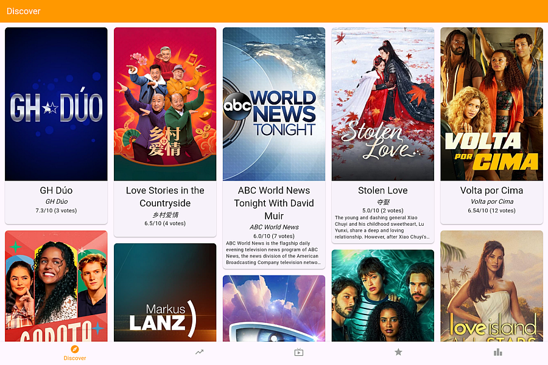
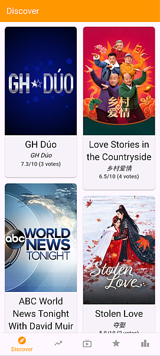
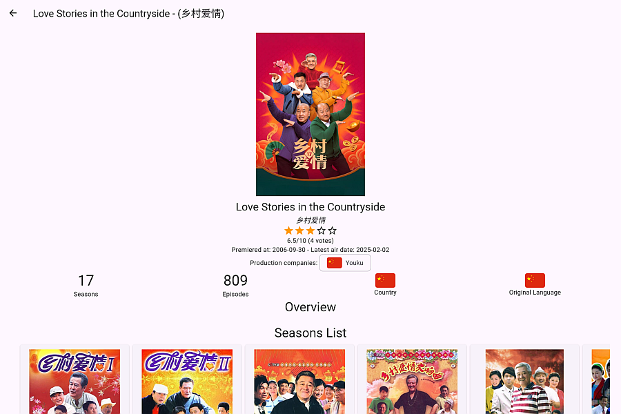
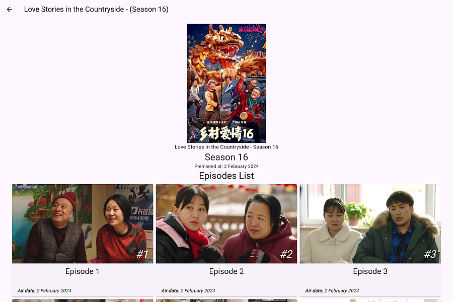
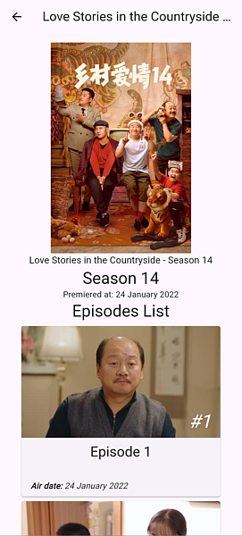

# BeeStream Pedia

The Movie & TV Show from your favorite streaming service in a wiki catalogue.

This project can be run in both **web** and **mobile** (Android/iOS) version. for iOS, and desktop version (Windows, MacOS, and Linux), you can clone this project & build it your own because the owner of the project compiles & test for web and Android mobile app only.

## Features

This project uses **TMDB API** for listing TV series list & series/season/episode information.

- **TV Series list catalogue**

  
  

  Consist of listing on-air, trending, popular and top rated TV series, acquired from TMDB.

- **TV Series detail**

  
  

  Look for TV series information detail (for example overview, region, language, rating, aired date, seasons & episodes) and check for season list & videos related to series.

- **Series season detail**

  
  

  Look for TV series seasons detail (for example rating, overview, and episodes) and list episodes for a season.


## Getting Started

Follow these steps to set up and run the project in your IDE.

### Prerequisites

- **Flutter SDK**: Make sure you have Flutter installed. If not, follow the [official installation guide](https://flutter.dev/docs/get-started/install).
- **IDE**: Android Studio, IntelliJ IDEA, or Visual Studio Code with the Flutter and Dart plugins installed.

### Installation

1. **Clone the repository**:
   ```bash
   git clone https://github.com/akmalrusli363/beestreampedia-flutter.git
   ```

2. **Navigate to the project directory**:
   ```bash
   cd beestreampedia
   ```

3. **Install dependencies**:
   ```bash
   flutter pub get
   ```

4. **Add TMDb API Key**:
   - Obtain an API key from [TMDB](https://www.themoviedb.org/) using your TMDB account & generate it through [API key in account settings page](https://www.themoviedb.org/settings/api).
   - Replace YOUR_API_KEY in the code with your actual API key.


### Running the project on mobile

1. **Open the project in your IDE**:
    - Open Android Studio, IntelliJ IDEA, or Visual Studio Code.
    - Select `Open` and navigate to the project directory.

2. **Set up an emulator or physical device** (if you run for mobile):
    - In Android Studio, use the AVD Manager to create and start an emulator.
    - Alternatively, connect a physical device via USB and enable USB debugging.

3. **Run the app**:
    - In the IDE, click the `Run` button (green play icon) or use the terminal:
      ```bash
      flutter run
      ```
      
### Running the project on web/desktop

1. **Ensure Web/Desktop App Support is Enabled:**
   ```bash
   flutter devices
   ```
   Alternatively, if you need to check for desktop support, use:
   ```bash
   flutter doctor
   ```
   
2. **Run the App for Web/Desktop:**
   ```bash
   flutter run -d chrome
   ```
   Replace `chrome` with `edge` or `web-server` if using other browsers. If you run on Desktop, use `windows`, `macos`, or `linux` corresponding to your operating system SDK.
   ```bash
   flutter run -d windows
   ```

### Additional Commands

- **Build the app**:
  ```bash
  flutter build apk
  ```
  or for iOS:
  ```bash
  flutter build ios
  ```
  and for web:
  ```bash
  flutter build web
  ```

- **Run tests**:
  ```bash
  flutter test
  ```

- **Check for formatting issues**:
  ```bash
  flutter format .
  ```

- **Analyze the code**:
  ```bash
  flutter analyze
  ```

## Contributing

If you'd like to contribute to this project, please follow these steps:

1. Fork the repository.
2. Create a new branch for your feature or bugfix.
3. Commit your changes.
4. Push your branch and submit a pull request.
